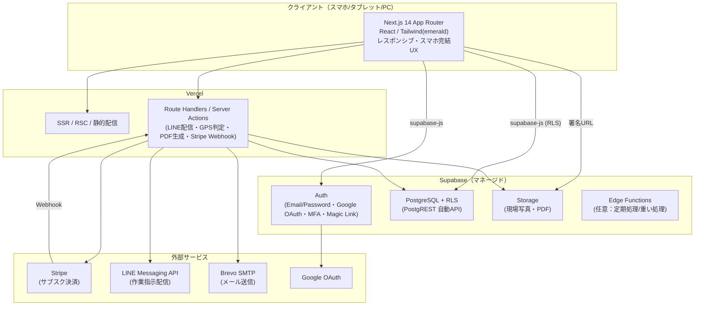

# 01. システムアーキテクチャ

## 1.1 方針

実デプロイ（Supabase 認証 + Vercel ホスティング）に準拠し、**Supabase + Vercel**
を主軸の構成とする。サーバーレス中心の構成により、1 社経営から複数拠点まで
スケールしつつ、運用工数（月 4-8 時間）と運用コスト（約 ¥3,000/月）を最小化する。

## 1.2 全体構成図

## 1.3 コンポーネント責務

| レイヤ | 技術 | 責務 |
|---|---|---|
| フロントエンド | Next.js 14（App Router）/ TypeScript / Tailwind CSS（emerald） | 画面描画、レスポンシブ UI、`supabase-js` による認証・データ操作 |
| BFF / サーバー処理 | Vercel Route Handlers / Server Actions | 外部 API 連携（LINE/Stripe/Brevo）、PDF 生成、GPS 判定、Webhook 受信 |
| 認証 | Supabase Auth | Email/Password・Google OAuth・MFA(TOTP)・パスワードリセット・セッション |
| データ | Supabase PostgreSQL + RLS | 業務データ永続化、テナント分離（行レベルセキュリティ） |
| 自動 API | Supabase PostgREST | テーブルに対する CRUD（RLS で保護） |
| ストレージ | Supabase Storage | 現場写真（最大 5 枚/報告）、生成 PDF の保存 |
| 定期/重処理 | Supabase Edge Functions（任意） | バッチ・スケジュール処理（将来） |

## 1.4 認証・通信フロー（概要）

1. クライアントは `supabase-js` で Supabase Auth に認証。JWT を取得。
2. 業務データの読み書きは JWT を付与して PostgREST（または Route Handler）へ。
   RLS により JWT 内の `tenant_id` / `role` に基づきアクセス制御。
3. 写真は Storage の署名 URL でアップロード/取得。
4. 外部連携（LINE 配信・PDF 生成・Stripe）は Route Handler 経由でサーバー側実行
   （シークレットはサーバー環境変数に保持し、クライアントへ露出しない）。

## 1.5 マルチデバイス対応

- **スマホ完結**を前提に、主要動線（報告・写真・GPS 到着）はモバイル最適化。
- Tailwind のブレークポイントでタブレット/PC のレイアウトも提供（`05_画面一覧.md`）。
- カメラ起動・位置情報取得は Web 標準 API（`getUserMedia` / `navigator.geolocation`）を使用。
- PWA 化（ホーム画面追加・オフライン下書き）は将来拡張候補。

## 1.6 譲渡資料スタックとのマッピング

譲渡資料は別スタックを記載しているが、実デプロイに合わせ以下のように読み替える。

| 譲渡資料の記載 | 本要件（Supabase/Vercel）での実現 | 備考 |
|---|---|---|
| FastAPI (Python) + SQLAlchemy | PostgREST（自動 API） + Next.js Route Handlers | 自前 API サーバー不要 |
| PostgreSQL | Supabase PostgreSQL | マネージド |
| Kubernetes (k3s) on Hetzner VPS | Vercel（サーバーレス）+ Supabase（マネージド） | k8s 運用不要 |
| Cloudflare R2 ストレージ | Supabase Storage | 署名 URL で配信 |
| WeasyPrint (Python) で PDF 生成 | Vercel/Edge での PDF 生成（`09` で方式比較） | 推奨は Puppeteer/Playwright |
| 自前 JWT + Google OAuth2 | Supabase Auth（JWT 発行・Google プロバイダ） | 認証 17 機能を内包 |
| GitLab CI | Vercel Git 連携（+ GitHub Actions 併用可） | `10` 参照 |
| Cloudflare CDN/Pages | Vercel Edge Network | — |

> 代替案として「譲渡資料どおりの FastAPI + k3s + R2 構成」も技術的には選択可能。
> ただし運用工数・コストが増えるため、本要件では Supabase/Vercel を推奨構成とする。

## 1.7 環境構成

| 環境 | 用途 | Supabase | Vercel |
|---|---|---|---|
| Development | 開発・検証 | dev プロジェクト | Preview デプロイ（PR 単位） |
| Production | 本番 | prod プロジェクト | 本番デプロイ（main） |

環境変数・CI/CD の詳細は `10_外部連携_運用.md`。
