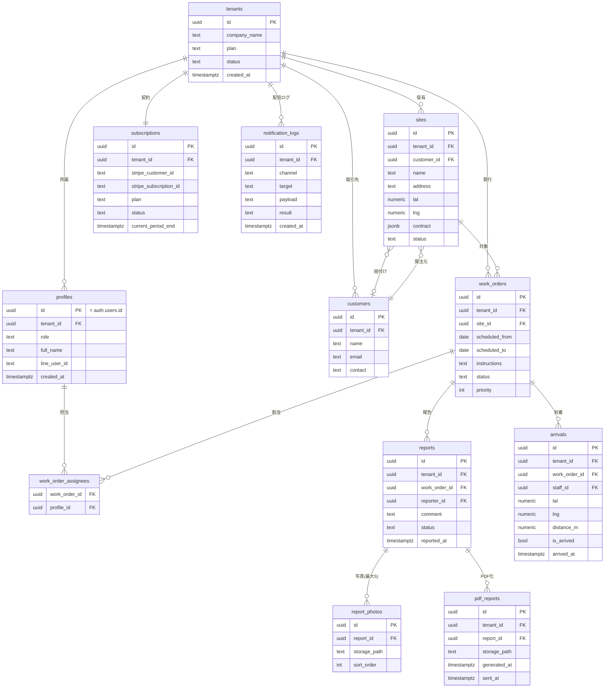

# 04. データモデル

> 本章のスキーマは譲渡資料に基づく **«推定»** である。到達可能環境での実機調査後に
> 実スキーマと突合し確定すること。型は PostgreSQL（Supabase）前提。

## 4.1 ER 図

## 4.2 テーブル定義（主要カラム）

### tenants（テナント＝清掃事業者）
| カラム | 型 | 説明 |
|---|---|---|
| id | uuid PK | テナント ID |
| company_name | text | 会社名 |
| plan | text | `free`/`starter`/`pro` |
| status | text | `active`/`suspended`/`canceled` |
| billing_email | text | 請求連絡先 |
| created_at | timestamptz | 作成日時 |

### profiles（ユーザー = スタッフ/管理者、auth.users と 1:1）
| カラム | 型 | 説明 |
|---|---|---|
| id | uuid PK | `auth.users.id` と一致 |
| tenant_id | uuid FK | 所属テナント |
| role | text | `owner`/`admin`/`staff` |
| full_name | text | 氏名 |
| phone | text | 電話 |
| line_user_id | text | LINE 連携 ID（FR-3 宛先解決） |
| is_active | bool | 有効フラグ |

### sites（現場）— FR-1
| カラム | 型 | 説明 |
|---|---|---|
| id | uuid PK | |
| tenant_id | uuid FK | |
| customer_id | uuid FK NULL | 取引先（顧客） |
| name | text | 現場名 |
| postal_code/prefecture/city/address_line/building | text | 住所要素 |
| lat / lng | numeric | 緯度経度（GPS 判定用） |
| contract | jsonb | 契約内容（種別・範囲・頻度・金額・期間） |
| status | text | `active`/`paused`/`canceled` |

### work_orders（作業指示）— FR-2
| カラム | 型 | 説明 |
|---|---|---|
| id | uuid PK | |
| tenant_id / site_id | uuid FK | |
| scheduled_from / scheduled_to | date | 日程範囲（フィルタ対象） |
| time_range | text | 時間帯 |
| instructions | text | 作業内容/指示 |
| checklist | jsonb | チェックリスト |
| priority | int | 優先度 |
| status | text | `todo`/`in_progress`/`done`/`confirmed` |

### work_order_assignees（作業指示の担当割当：多対多）
| カラム | 型 | 説明 |
|---|---|---|
| work_order_id | uuid FK | |
| profile_id | uuid FK | 担当スタッフ |

### reports（現場報告）— FR-4
| カラム | 型 | 説明 |
|---|---|---|
| id | uuid PK | |
| tenant_id / work_order_id / reporter_id | uuid FK | |
| comment | text | 完了コメント |
| result | jsonb | 実施チェックリスト |
| status | text | `draft`/`submitted`/`approved`/`rejected` |
| reported_at | timestamptz | 報告日時 |

### report_photos（報告写真：最大 5）— FR-4
| カラム | 型 | 説明 |
|---|---|---|
| id | uuid PK | |
| report_id | uuid FK | |
| storage_path | text | Supabase Storage パス |
| sort_order | int | 表示順（0-4） |

> 上限 5 枚は UI・サーバー・DB（部分制約/トリガー）で多層的に担保。

### arrivals（GPS 到着）— FR-5
| カラム | 型 | 説明 |
|---|---|---|
| id | uuid PK | |
| tenant_id / work_order_id / staff_id | uuid FK | |
| lat / lng | numeric | 取得座標 |
| distance_m | numeric | 現場との距離（m） |
| is_arrived | bool | 200m 以内判定 |
| method | text | `auto`/`manual` |
| arrived_at | timestamptz | 記録時刻 |

### customers（顧客＝取引先）
| カラム | 型 | 説明 |
|---|---|---|
| id | uuid PK | |
| tenant_id | uuid FK | |
| name | text | 取引先名 |
| email | text | PDF 送付先 |
| contact | text | 担当者・連絡先 |

### pdf_reports（生成 PDF）— FR-6
| カラム | 型 | 説明 |
|---|---|---|
| id | uuid PK | |
| tenant_id / report_id | uuid FK | |
| storage_path | text | PDF 保存先 |
| generated_at | timestamptz | 生成日時 |
| sent_at | timestamptz NULL | 顧客送付日時 |

### subscriptions（Stripe 連携）— `08`
| カラム | 型 | 説明 |
|---|---|---|
| id | uuid PK | |
| tenant_id | uuid FK | |
| stripe_customer_id / stripe_subscription_id | text | Stripe 識別子 |
| plan | text | `free`/`starter`/`pro` |
| status | text | `active`/`past_due`/`canceled` 等 |
| current_period_end | timestamptz | 次回更新日 |

### notification_logs（配信ログ）— FR-3/`09`
| カラム | 型 | 説明 |
|---|---|---|
| id | uuid PK | |
| tenant_id | uuid FK | |
| channel | text | `line`/`email` |
| target | text | 宛先（line_user_id / email） |
| payload | text | 送信内容（要約） |
| result | text | `success`/`failed`/`skipped` |
| created_at | timestamptz | 送信日時 |

## 4.3 RLS（行レベルセキュリティ）方針

- 全業務テーブルに `tenant_id` を持たせ、`tenant_id = auth.jwt() ->> 'tenant_id'`
  に一致する行のみ参照/更新可とするポリシーを設定。
- スタッフ向けには追加で「自分が担当 or 自分が作成」した行に限定するポリシーを併用
  （`reports`/`arrivals`/`work_orders` の更新系）。
- `profiles.role` に応じた書き込み制御（owner/admin のみ作成・削除可 等）。
- Service Role Key を用いるサーバー処理（Webhook 等）は RLS をバイパスするため、
  Route Handler 側で明示的にテナント検証を行う。

## 4.4 ストレージ構成（Supabase Storage）

| バケット | 用途 | アクセス |
|---|---|---|
| `report-photos` | 現場報告写真 | 非公開・署名 URL |
| `pdf-reports` | 生成 PDF | 非公開・署名 URL |
| `tenant-assets` | 会社ロゴ等（PDF ヘッダ） | 非公開・署名 URL |

パス規約: `{bucket}/{tenant_id}/{entity_id}/{file}` でテナント分離。
