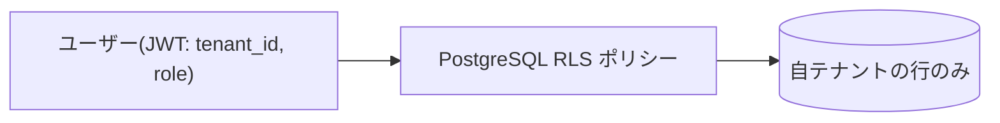

# 07. 認証・認可

## 7.1 方針
- 認証基盤は **Supabase Auth**（JWT 発行）。
- 譲渡資料の「認証 17 機能完備（メール・Google ログイン・パスワードリセット・2FA 等）」を
  Supabase Auth の標準機能で満たす。
- マルチテナント分離は JWT クレーム（`tenant_id`・`role`）+ RLS で実現。

## 7.2 認証 17 機能の対応表

> 資料は「17 機能」と記載のみのため、Supabase Auth で提供可能な機能を 17 項目として
> 整理する **«推定»**。実機調査で確定する。

| # | 機能 | 実現方法（Supabase Auth） |
|---|---|---|
| 1 | メール + パスワード サインアップ | `signUp` |
| 2 | メール + パスワード ログイン | `signInWithPassword` |
| 3 | メールアドレス確認（確認メール） | Confirm email（有効化） |
| 4 | パスワードリセット要求 | `resetPasswordForEmail` |
| 5 | 新パスワード設定 | `updateUser`（リセットリンク経由） |
| 6 | パスワード変更（ログイン中） | `updateUser` |
| 7 | Google ログイン（OAuth） | `signInWithOAuth('google')` |
| 8 | Magic Link（パスワードレス） | `signInWithOtp` |
| 9 | 2FA / MFA（TOTP）登録 | `mfa.enroll` |
| 10 | 2FA / MFA チャレンジ・検証 | `mfa.challenge` / `mfa.verify` |
| 11 | セッション維持・自動更新 | refresh token によるセッション更新 |
| 12 | ログアウト（単一/全セッション） | `signOut` |
| 13 | スタッフ招待（メール招待） | `inviteUserByEmail`（Admin API） |
| 14 | メールアドレス変更 | `updateUser`（確認付き） |
| 15 | アカウント無効化/削除 | Admin API + `profiles.is_active` |
| 16 | OAuth コールバック処理 | `/auth/callback` ルート |
| 17 | 認証メール送信（カスタム SMTP） | Brevo SMTP 連携（`09`） |

## 7.3 ロール（RBAC）

| ロール | 説明 | 主権限 |
|---|---|---|
| Owner（経営者） | テナント作成者・最高権限 | 全機能 + 課金管理 + テナント設定 |
| Admin（管理者） | 運用管理者 | 現場/指示/報告/スタッフ管理・PDF・配信 |
| Staff（スタッフ） | 現場作業者 | 自担当の指示閲覧・到着・報告・写真 |
| Customer（顧客） | 取引先 | （MVP では画面ログインなし。PDF はメール受領） |

- `profiles.role` に保持し、JWT カスタムクレームへ反映（DB トリガー / Auth Hook）。
- 顧客向けポータルは将来拡張（MVP は PDF メール送付のみ）。

## 7.4 マルチテナント分離

- サインアップ時に `tenants` を作成し、作成者を `owner` として `profiles` に登録。
- 招待されたユーザーは招待元テナントに `admin`/`staff` として参加。
- 全業務テーブルの RLS で `tenant_id` 一致を強制（`04` 参照）。
- 機密処理（Webhook 等）の Service Role 利用時は Route Handler でテナント検証。

## 7.5 セキュリティ要件
- パスワードポリシー（最小長・複雑性）を Supabase 設定で強制。
- ブルートフォース対策・レート制御（Supabase 標準 + アプリ層）。
- セッション失効・MFA 必須化（管理者向け）をテナント設定で選択可能（将来）。
- 監査: 重要操作（招待・権限変更・削除）はログ記録。
