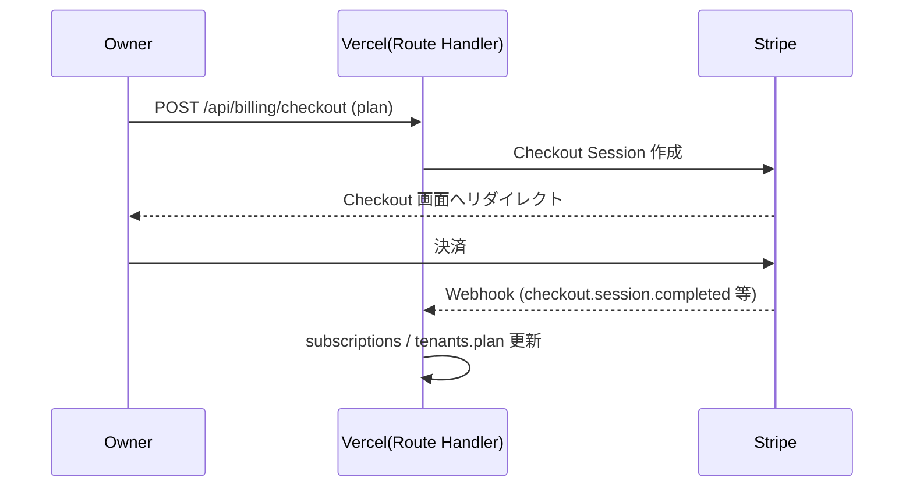

# 08. 決済・プラン

## 8.1 方針
- 決済は **Stripe サブスクリプション**。譲渡資料どおり「本番接続済・キー切替で即時収益化」
  を踏襲し、テスト/本番キーの切替で運用する。
- プランは 3 構成。プラン情報は `tenants.plan` と `subscriptions` で管理。

## 8.2 プラン定義

| プラン | 月額(税込目安) | 現場上限 | スタッフ上限 | GPS 到着(FR-5) | 顧客 PDF(FR-6) | 位置づけ |
|---|---|---|---|---|---|---|
| Free | ¥0 | 3 件 | 5 名 | × | × | リード獲得・無料トライアル |
| Starter | ¥1,980 | 20 件 | 20 名 | × | × | 標準機能 |
| Pro | ¥4,980 | 無制限 | 無制限 | ○ | ○ | 全機能 |

> 上限値・機能割当は資料の記述に準拠 **«要確定»**（Free/Starter での GPS・PDF の
> 可否は実機調査で確認。資料上は Pro に GPS・PDF を明記）。

## 8.3 機能ゲート / 上限制御
- **二層で強制**: ① UI（ボタン非活性・アップグレード導線）② サーバー（Action/Route で
  プラン検証し拒否）。クライアントのみに依存しない。
- 上限チェック:
  - 現場作成時に `count(sites)` がプラン上限未満か検証（FR-1 受入基準）。
  - スタッフ招待時に在籍数を検証（`07`）。
- 機能ゲート:
  - GPS 到着確認・PDF 生成は Pro のみ許可。Free/Starter ではアップグレード案内。

## 8.4 決済フロー

- アップグレード/ダウングレード/解約は **Stripe カスタマーポータル**
  （`POST /api/billing/portal`）を利用。
- Webhook（`POST /api/webhooks/stripe`、署名検証）で以下を同期:
  - `checkout.session.completed` → 契約開始
  - `customer.subscription.updated` → プラン/状態更新
  - `customer.subscription.deleted` → 解約 → Free へ降格
  - `invoice.payment_failed` → `past_due` 状態反映
- 冪等処理（イベント ID 記録）で重複反映を防止。

## 8.5 設定・環境変数（`10` と整合）
| 変数 | 用途 |
|---|---|
| `STRIPE_SECRET_KEY` | サーバー側 Stripe 操作 |
| `STRIPE_WEBHOOK_SECRET` | Webhook 署名検証 |
| `NEXT_PUBLIC_STRIPE_PUBLISHABLE_KEY` | クライアント |
| `STRIPE_PRICE_STARTER` / `STRIPE_PRICE_PRO` | 各プランの Price ID |

- 本番移行は本番キー・本番 Price ID に切替えるのみ（資料の「キー切替で即時収益化」）。

## 8.6 受入基準
- [ ] Owner が Starter/Pro を購入でき、`tenants.plan` が更新される。
- [ ] 解約時に Free へ降格し、Pro 限定機能（GPS/PDF）が無効化される。
- [ ] 上限超過時に作成/招待がサーバー側で拒否され、アップグレード導線が出る。
- [ ] Webhook が署名検証され、重複イベントでも整合が保たれる。
